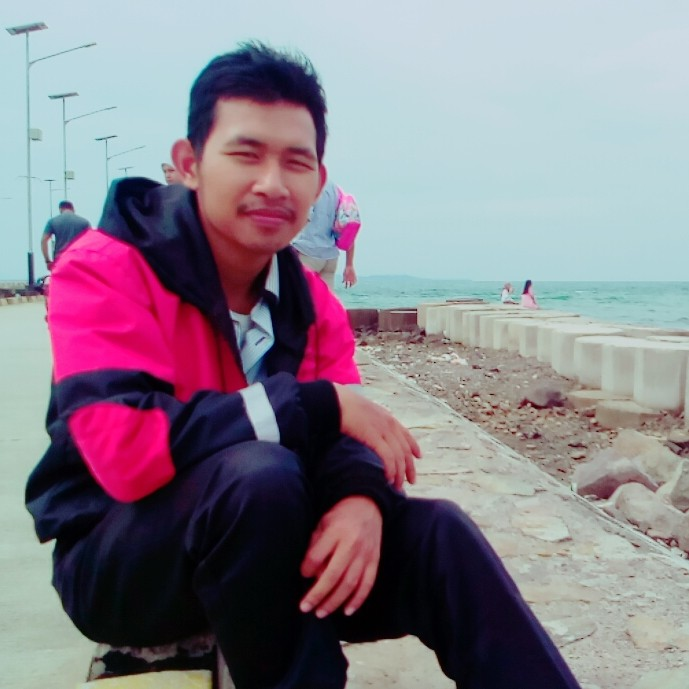

Nama saya aep saepudin, saya lahir di banten tepatnya pada 1 Maret 1994 dan merupakan anak pertama dari 3 bersaudara.
Berikut Sedikit tentang riwayat pendidikan saya
# Riwayat Pendidikan

| Sekolah | Tahun Lulus |
|:--------|:------------|
| **SDN Nembol 3** | **2000 - 2006** |
|**MTSN 1 Pandeglang** | **2007 - 2009** |
|**SMKN 1 Pandeglang** | **2010 - 2012**|
|[**UNMA Banten**](http://unmabanten.ac.id/ "Situs Unma Banten")| **2014 - 2018**|


Semenjak saya masuk SMK di kota _**Pandeglang**_ saya mulai tertarik dengan komputer, jurusan yang saya ambil ketika saya di __SMK__ adalah jaringan, namun setelah saya lulus dari bangku **SMK** saya sedikit mencari pengalaman dengan bekerja sebagai buruh pabrik di kabupaten _**Tangerang**_.
Sepulang dari kabupaten _**Tangerang**_ saya melanjutkan pendidikan dengan kuliah universitas yang berada di kota _**Pandeglang**_ tepatnya di [Universitas Mathla'ul Anwar](http://www.unma.ac.id/ "Unma banten") mengambil jurusan di system informasi.
Pengalaman Kerja Saya :
## Pengalaman Kerja
| Perusahahaan | Tahun | Status |
|:--------|:------------|:-------|
| **Carlita TV** | **2012** | **Magang** |
|**Innoware** | **2013** | **Operator Produksi** |
|**Kominfo Banten** (https://diskominfo.bantenprov.go.id/ "Situs Kominfo")| **2018**| **Magang** |
|[**PT Mess Sejahtra**](https://www.berlcosmetics.com/ "Berl Cosmetics")| **2019**| **Programer Web**|

Sedikit mengenai Biodata Saya :
## Biodata
```
Nama                    : Aep Saepudin
Tempat Tanggal  Lahir   : Pandeglang, 01-03-1994
Alamat                  : kp. kaduhang, Desa Nembol,
                          kec. Mandalawangi
                          kab. Pandeglang - Banten
Jenis Kelamin           : Laki - Laki
Agama                   : Islam
```
Demikian untuk biodata saya yang saya buat dengan sebenarnya, terakhir yaitu moto hidup bagi saya.
## Moto Hidup
> **Nothing Not Impossible.**

> *Berusaha dan sabar*

Sekian dari saya dan terima kasih.
